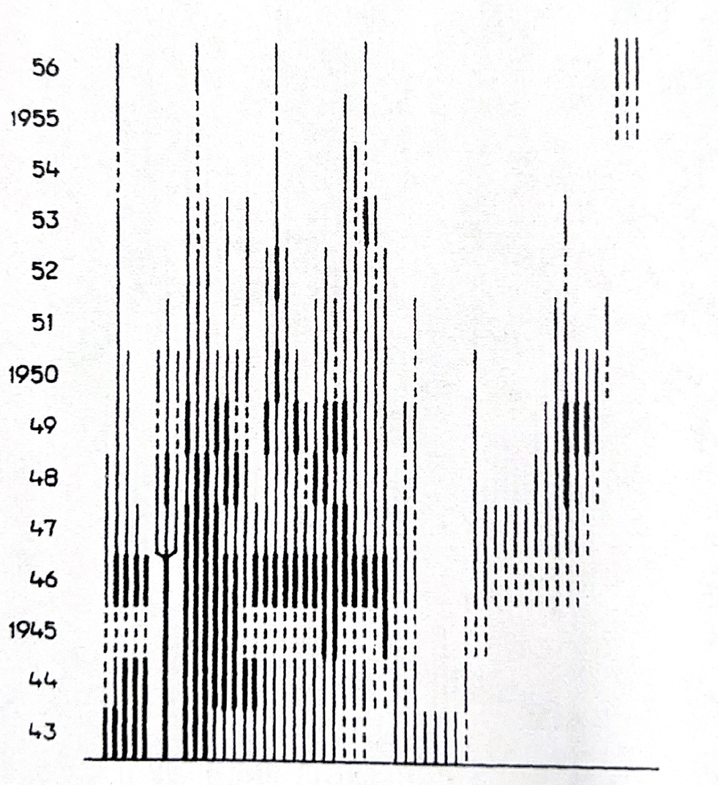

# Carl Olaf Tamm


```{r, OCTamm_A, eval= T, echo=FALSE, message=F}
if (!require("pacman")) install.packages("pacman")
pacman::p_load(janitor, tidyverse, devtools, popbio, knitr, gt)

library(tidyverse)
library(janitor)
library(popbio)

library(knitr)
library(gt)

# Mi tema de formato de las gráficas de ggplot2 personal
rlt_theme <- theme(axis.title.y = element_text(colour="grey20",size=15,face="bold"),
        axis.text.x = element_text(colour="grey20",size=15, face="bold"),
        axis.text.y = element_text(colour="grey20",size=15,face="bold"),  
        axis.title.x = element_text(colour="grey20",size=15,face="bold"))
```


## Quien es Carl Olaf Tamm?

Carl Olaf Tamm (1919-2007) fue un biólogo Sueco y profesor de botánica y suelos de la escuela de "Soil Science at the Royal College of Forestry" (1957-1962) en Estocolmo y el primer profesor de **ecología de bosques** de dicha universidad (1962). Su carrera académica se desarrolló en la Universidad de Estocolmo, donde fue profesor de ecología de bosques desde 1957 hasta 1985. Los trabajos de Tamm son reconocidos por trabajos a largo plazo, de múltiples años y décadas, enfatizando la importancia de la variabilidad temporal en los ecosistemas. 

Tamm desarrollado protocolos de muestreos de plantas y suelos en bosques, donde la recolección de datos era anuales y continuos. Algunos de estos trabajos son ahora conocidos como clásicos en ecología de poblaciones y comunidades. Tres de estos trabajos relevante a la dinamica poblacional incluye: 

 - Observation on reproduction and survival of some perrenial herbs [@tamm1948observations].
 - Further observations on the survival and flowering of some perennial herbs, I [@tamm1956further].
 - Survival and flowering of some perennial herbs. II. The behaviour of some orchids on permanent plots [@tamm1972survival].
 
 En la descripción de la dinámica de los individuos muestreado a través del tiempo Tamm incluyo la variabilidad temporal en la reproducción y supervivencia de las plantas, basado en su presencia o ausencia, si eran reproductivo o no, reclutamiento y individuos que se clonan en adición de si las plantas eran latentes. El utilizo un sistema de presentación de la dinámica de los individuos usando una linea por individuo y identificando en que etapa estuviese en cada año.

*** 
Representación de los datos de Tamm

Los datos de Tamm fueron compartido de forma visual usando gráficos. En la figura cada linea vertical representa un individuo

  - linea gruesa, individuo reproductivo
  - linea fina, individuo vegetativo
  - linea entrecortada: individuo no muestreado
  - linea bifurcada: individuo que se clonan
  
  
  
  WRONG FIGURE; use Fig. 1 D. incarnata from Tamm 1972 
```{r, OCTamm_B, echo=FALSE, out.width="50%", fig.cap="Tamm: 1972, Orchis mascula"}

```
 


En la publicación de 1972, Tamm describe la dinámica de múltiples especies de orquideas, y alguna especies en múltiples sitios.

```{r, OCTamm_C, echo=FALSE, message=FALSE}
library(tidyverse)
library(gt)
 Tamm=tribble(~Especies, ~"Núm de la Población", ~"Año del primer muestreo", ~"Año del último muestreo",
              "Dactylorhiza incarnata", 46, 1944, 1971,
              "Dactylorhiza sambucina", 17, 1942, 1971,
              "Dactylorhiza sambucina", 18, 1943, 1964,
              "Dactylorhiza sambucina", 19, 1943, 1957,
              "Dactylorhiza sambucina", 20, 1943, 1957,
              "Dactylorhiza sambucina", 21, 1943, 1957,
              "Dactylorhiza sambucina", 22, 1943, 1957,
              "Orchis mascula", 24, 1943, 1956,
              "Listera ovata", 48, 1944, 1971)

gt(Tamm)
```

***

Tamm creo en el campo parcela de 0.5m x 0.5m o de 1.0m x 1.0m y muestreo todos los individuos en la parcela en años consecutivos (las lineas entrecortada son años no muestreados). Tamm estaba interesado en la dinámica de las orquídeas porque había notado que los individuos no florecen todo los años, y que la floración era un evento raro. Por ejemplo que en *Orchis sambucina* (ahora *Dactylorhiza sambucina*) nota que en 1942 solamente 7 plantas florecieron y que en 1945 había 40 con flores [@tamm1948observations]. Tamm sugiere que la poca cantidad de nuevos individuos pudiese ser correlacionado con la competencia para recursos (nutrientes, luz y agua) y que la capacidad de las plantas de sobrevivir eventos difíciles en parte esta correlacionado con la plantas de mayor edad que pudiese tener una menor probabildad de supervivencia [@tamm1948observations]. 

En la publicación de 1972, Tamm describe la dinámica de cuatro especies orquídea. Esta información no esta disponible en COMPADRE al momento. En *Dactylorhiza incarnata* observa que múltiples individuos desaparece de un año a otro, que después de 1951 la población es mayormente vegetativa (sin flores).  Usando las figuras Tamm trato de ver si había un patrón en la dinámica basado en el cambio de la comunidades, por ejemplo la presencia de un árbol de pino que se estableció cerca de la población de *D. sambucina*. La población de *D. sambucina* disminuyo un poco entre 1942 a 1963, pero fue balanceado por el reclutamiento de la misma cantidad de individuos en el mismo periodo. Después de revisar sus datos Tamm sugiere que lo que parece ser individuos nuevos por clonaje pudiese ser realmente de nuevos individuos independiente, solamente muy cerca de un individuo establecido anteriormente.  La dificultad de muestrear con confianza los individuos en su ambiente es un reto en la interpretación de los datos de plantas pereniales.
 
En *Orchis mascula*, Tamm observa claramente que la plantas florecen de forma irregular, y que parece tener patrones entre años, que algunos años favorecen la presencia de inflorescencias y otros años no.  En *Listera ovata*, Tamm observa que la población crece, y que hay mucho reclutamiento entre 1944 y 1971, con un incremento de individuos de más de 200% comparando al primer año de muestreo.

En adición el demuestra que hay individuos que pueden vivir por muchos años. La edad de algunos individuos de los que muestreo es de 30 años para *D. sambucina*, 28 años para *L. ovata*, 25 años *D. incarnata* y 14 años para *O. mascula*.

Tamm fue un pionero en la ecología de poblaciones y comunidades, y sus trabajos son reconocidos por su enfoque en la variabilidad temporal en los ecosistemas. 


***

## Re-evaluación de los datos de Tamm


En la próxima sección se estará re-evaluando los datos de Tamm con métodos recientes.  

Primero se estará digitalizando los datos, seguido de construcción de matriz siguiendo de análisis de viabilidad de poblaciones y otras métricas de dinámica de poblaciones. 


## Instalación de raretrans #2

Para instalar **raretrans** remover el **#** antes de correr el script para tener acceso a los códigos de **raretrans**. 

```{r OCTamm_2}
#library(devtools)

#devtools::install_github("atyre2/raretrans", build = TRUE, build_opts = c("--no-resave-data", "--no-manual"))

library(raretrans)


```


Subir los datos de Tamm

Se puede tener acceso a los datos de Tamm en el archivo "Tamm_1972.xlsx" en la carpeta "data" en Github.

Estos datos estan limitado a la especie de *Dactylorhiza incarnata* y se tiene información de los 35 individuos monitoreado en los años 1944 hasta 1971.

```{r OCTamm_3}
library(readxl)
Tamm_1972_column <- read_excel("data/Tamm_1972.xlsx", 
    sheet = "D_incarnata_by_column")

Tamm_1972_column %>% head()
```


El primer paso es encontrar la matriz de valores *prior* para añadir al modelo de construcción de los parámetros de la matriz.  Como no puedo discutir de estos valores con Tamm, use valores de la literatura. Hay dos especies de *Dactylorhiza* con matrices en COMPADRE, usando la que más se parece a los datos de los datos de Tamm, se uso como valores **prior** los de *Dacylorhiza lapponica* [@sletvold2010long].  Se modifico la matriz porque podemos solamente determinar si un individuo falleció después de ser latente. Entonces la suma de probabilidades de vegetativo y reproductivo suman a 1.0 y los latentes no suma a 1.0 (la diferencia es los fallecidos). 


```{r OCTamm_4}
Dacty_apriori=matrix(c(0.637, 0.571, 0.740,
                       0.273, 0.271, 0.049,
                       0.090, 0.158, 0.059,
                       0,     0,     0.152),  nrow = 4, ncol = 3, byrow=TRUE) # la ultima fila es la proporción de individuos en esta etapa que fallece. 

Dacty_apriori


```


## Construcción de la matriz de transición

- Las etapas en el modelo son Vegetativo (sin flores), Floreciendo (con flores), y Latente (no avistamiento en un año particular) más los fallecidos. 
- La matriz de transiciones es una matriz de 3x3, donde las filas son las etapas actuales (tiempo t) y las columnas son las etapas futuras (tiempo t+1).

- Supuestos:
   - que los individuos no pueden ser latentes más de dos años consecutivos. Todo individuo que no es visto después de dos años es considerado fallecido.  Ese supuesto proviene de haber evaluado la figura de Tamm y ver que no hay individuos que no son vistos después de dos años consecutivos de ser latentes.
   - un individuo fallecido no puede regresar en un estado en el futuro.


```{r OCTamm_6}

Tmat_D <- Tamm_1972_column %>% 
  dplyr::select(Year, stage, next_stage, Fertility) %>% 
  mutate(stage = factor(stage, levels=c("V","F","D","m")),
         fate = factor(next_stage, levels=c("V","F","D","m"))) %>%
  drop_na(stage, fate) %>%
  as.data.frame() %>% 
  xtabs(~fate + stage, data = .) %>% 
  as.matrix() 

Tmat_D # se contabiliza la cantidad de individuos que pasan de una etapa a otra.

Tmat2 <- Tmat_D[,-4] # remover la columna para transiciones de la muerte (es imposible pasar de fallecido a otra etapas)
Tmat2

N2_D <- colSums(Tmat2) # obtener el número total de una etapa.
N2_D
Tmat <- sweep(Tmat2[-4,], 2, N2_D, "/") # normalizar las transiciones, nota que el "2" es para decir que haga los cálculos por columna
Tmat # la matriz de transiciones normalizada con los datos del campo
```

***

## Constucción de la matriz de fertilidad


Para tomar en cuanta la fecundidad, se necesita una matriz de fertilidad. En este caso los datos son muy limitados, tenemos solamente la cantidad de individuos que florecieron en 1944.  Para simplificar, se asume que la cantidad de individuos que florecieron en 1944 (n=5), 1948 (n=1), 1949 (n=2) y 1951 (n=1) es la cantidad de semillas que producen. Solamente el individuo #5 se reprodujo dos veces.  Asumimos que todos los nuevos individuos en la población provienen de estos individuos floreciendo y que ningún reclutamiento proviene de fuentes externas, entonces la matriz de fertilidad es la siguiente. De 9 individuos florecidos tenemos 15 individuos nuevos entre 1949 a 1967. Nota aquí que no es la cantidad de semillas producidas, por que no tenemos la información de cual es la cantidad de semillas que germinan y se establecen. Lo que tenemos es la cantidad de individuos que florecen y por consecuencia producen nuevos individuos vegetativo. El calculo es 15 individuos nuevos por 9 individuos florecidos = 1.66667 individuos nuevos por individuo florecido. El otro supuesto es que las semillas pueden ser latentes por múltiples años, o se puede que germinan pero no producen individuos vegetativo o con flores inmediatamente, entonces un periodo de latencia después de germinar (esa etapa no esta en el modelo). 


```{r OCTamm_7}

Fmat <- matrix(0, nrow=3, ncol=3) # crear una matriz de ceros. 
Fmat[1,2] <- 15/9 # contar 9 adultos reproductivos en el tiempo t y 15 nuevos individuos a la población. 
TF2 <- list(Tmat = Tmat, Fmat = Fmat)
TF2
```

***

¿Como se ve el ciclo de vida de esa especie en esto años? 


```{r OCTamm_8, echo=FALSE, message=FALSE, warning=FALSE}
library(Rage)
library(DiagrammeR)


matA=TF2$Tmat+TF2$Fmat

etapas <- c("Vegetativo", "Florecido", "Latente")
title <- NULL
graph <- expand.grid(to = etapas, from = etapas)
graph$trans <- round(c(matA), 3)
graph <- graph[graph$trans > 0, ]
nodes <- paste(paste0("'", etapas, "'"), collapse = "; ")
graph$min_len <- (as.numeric(graph$to) - as.numeric(graph$from)) * 3
graph$col <- c(
  "red2", "PaleGreen4", "PaleGreen4",
  "goldenrod1", "PaleGreen4",
  "PaleGreen4", "red2"
)
edges <- paste0("'", graph$from, "'", " -> ", "'", graph$to, "'",
  "[minlen=", graph$min_len,
  ",fontsize=", 8,
  ",color=", graph$col,
  ",xlabel=", paste("\"", graph$trans),
  "\"]\n",
  collapse = ""
)
grViz(
  paste(
    "
digraph {
  {
    graph[overlap=false];
    rank=same;
    node [shape=", "egg", ", fontsize=", 12, "];",
    nodes, "
  }",
    "ordering=out
  x [style=invis]
  x -> {", nodes, "} [style=invis]", edges,
    "labelloc=\"t\";
  label=\"", title, "\"
}"
  )
) 


```


Ahora usamos la información las matrices de transiciones, fertilidades y sus valores de prior para calcular los parámetros de la especie

Comparan la matriz original con los valores de la matriz posterior, usando la función "priorweight" uno puede reducir la confianza que uno tiene sobre los valores prior. Nota que como estos valores provienen de otra especies es buen idea reducir la confianza que uno tiene sobre estos valores en los análisis usando un priorweight pequeño. 
El valor de 0.01, es que se usa 1% de los valores prior y 99% de los valores del campo. Por consecuencia domina los valores del campo. 

. 
```{r OCTamm_9}

TF2$Tmat

TF3=fill_transitions(TF2, N2_D, P = Dacty_apriori, priorweight = .01)

TF3 # la matriz de transiciones posterior
```

Como esperado la población de *Dactylorhiza incarnata* disminuye en el tiempo y el indice de crecimiento es menor que 1.0. 


```{r OCTamm_10}
popbio::lambda(TF3)


```


## Simulando el crecimiento poblacional 


Simulado los matriz, el tamaño de muestra (N2_d), las matriz de los valores del campo (TF2), la matriz de los valores prior (Dacty_apriori), el peso de los valores prior (priorweight), los prior de fertilidad y el número de simulaciones (samples = 5000). Con esta simulación podemos calcular el intervalo de confianza del crecimiento poblacional de *Dactylorhiza incarnata* muestreado por Tamm desde 1944 a 1971.  

las matrices alpha2 y beta2, representan los parámetros de la distribución gamma con media alpha/beta.  En este caso se usan valores muy pequeños para los valores alpha y beta, para que la distribución gamma sea informativa (non-informative priors) y que los valores de lambda sean muy dispersos. En otra palabra no ponemos peso en los valores prior de la fertilidad, y dejamos que los valores del campo dominan los análisis.  


```{r OCTamm_11a, eval=TRUE, echo=TRUE}
library(popbio)

alpha2 <- matrix(c(NA_real_, 1e-5, NA_real_,
                   NA_real_, NA_real_, NA_real_,
                   NA_real_, NA_real_, NA_real_), nrow=3, ncol = 3, byrow = TRUE) # la matriz de los valores alpha
beta2 <- matrix(c( NA_real_, 1e-5, NA_real_,
                   NA_real_, NA_real_, NA_real_,
                   NA_real_, NA_real_, NA_real_), nrow=3, ncol = 3, byrow = TRUE) # la matriz de los valores beta
```

```{r OCTamm_11b, eval=TRUE, echo=TRUE}

Dacty_0.1 <- sim_transitions(TF2, N2_D, P = Dacty_apriori, alpha = alpha2, beta = beta2,
                priorweight = 0.1, samples = 5000) # generar 5000 matrices basado en las previas de transiciones y de fertilidades, el tamaño de muestra, en adición de los datos


```


```{r OCTamm_11c, eval=TRUE, echo=TRUE}
Dacty_0.1b <- tibble(lposterior = map_dbl(Dacty_0.1, lambda))

```


## Visualización de las distribuciones de los lambda

```{r OCTamm_11d}
ggplot(data = Dacty_0.1b,
     mapping = aes(x = lposterior)) + 
  geom_histogram(binwidth = 0.01, colour="white") + 
  rlt_theme+ geom_vline(xintercept = 1, 
                color = "blue", size=1.5)
```

***


Para concluir, la población de *Dactylorhiza incarnata* muestreado por Tamm desde 1944 a 1971 tiene un crecimiento poblacional menor que 1.0 (lambda promedio de 0.82), con un intervalo de confianza de 0.76 a 0.87.  Esto indica que la población esta reduciendo en el tiempo por aproximadamente 18%.


```{r OCTamm_12m, eval=T}
Dacty_0.1bdf=as.data.frame(Dacty_0.1b)
Dacty_0.1_summary <- dplyr::summarize(Dacty_0.1bdf,
                            medianL = median(lposterior),
                             meanL = mean(lposterior),
                             lcl = quantile(lposterior, probs = 0.025),
                             ucl = quantile(lposterior, probs = 0.975),
                             pincrease = sum(lposterior > 1.)/n()
                            )


```


```{r OCTamm_12b, eval=T}
gt(signif(Dacty_0.1_summary, digits = 3))


```


Revisión RLT: Oct 7, 2024

Revisión RLT: Oct 8, 2024


```{r OCTamm_13, echo=FALSE, eval=FALSE}

D_incarnata_1 <- Tamm_1972 %>%   
 select("1944", "1948", "F_1944") |> 
  rename("stage" = "1944", "next_stage" = "1948") %>% 
  drop_na()


TF <- popbio::projection.matrix(as.data.frame(D_incarnata_1), 
                        stage = stage, fate = next_stage, 
                        fertility="F_1944", sort=c("V","F","D"), TF = TRUE)


N <- get_state_vector(D_incarnata_1, stage = stage, sort=c("V","F","D")) 
N = N %>% 
  replace_na(0) # Un vector de la cantidad de individuos iniciales para cada etapa, nota que la cantidad por etapa, "stage", son los individuos en el primer muestreo, si no hay se añade un cero


```


```{r, OCTamm_14, echo=F, eval=FALSE}


D_incarnata_1 <- Tamm_1972 %>%   
 select("1944", "1948") |> 
  rename("stage" = "1944", "fate" = "1948")


head(D_incarnata_1) # ahora tenemos solamente los años 1944 y 1948. 
# Crear TF = TRUE, añadir para formatear correctamente.
TF <- popbio::projection.matrix(as.data.frame(D_incarnata_1), 
                        stage = stage, fate = fate, 
                         sort=c("V","F"), TF = TRUE)
TF # Este es la estructura de etapas de vida para esa población en este tiempo.  Nota que tenemos dos matrices, una de transiciones **T** y otra de fertilidad **F**. 


```

```{r OCTamm_15, eval=FALSE, echo=FALSE}
D_incarnata_2 <- Tamm_1972 %>%   
 select("1948", "1949") |> 
  rename("stage" = "1948", "fate" = "1949")


head(D_incarnata_2) # ahora tenemos solamente los años 1944 y 1948. 
# Crear TF = TRUE, añadir para formatear correctamente.
TF <- popbio::projection.matrix(as.data.frame(D_incarnata_2), 
                        stage = stage, fate = fate, 
                        sort=c("V","F"), TF = TRUE)
TF # Este es la estructura de etapas de vida para esa población en este tiempo.  Nota que tenemos dos matrices, una de transiciones **T** y otra de fertilidad **F**. 
```


```{r OCTamm_16, echo=F, eval=FALSE}
D_incarnata_3 <- Tamm_1972 %>%   
 select("1949", "1950") |> 
  rename("stage" = "1949", "fate" = "1950")


head(D_incarnata_3) # ahora tenemos solamente los años 1949 y 1950. 
# Crear TF = TRUE, añadir para formatear corectamente.
TF <- popbio::projection.matrix(as.data.frame(D_incarnata_3), 
                        stage = stage, fate = fate, 
                        sort=c("V","F"), TF = TRUE)
TF # Este es la estructura de etapas de vida para esa población en este tiempo.  Nota que tenemos dos matrices, una de transiciones **T** y otra de fertilidad **F**. 
```
